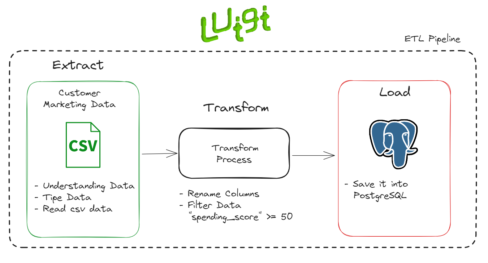

# Simple Luigi Pipeline

## Problem

- Tim Marketing ingin melakukan campaign untuk customer yang memiliki **highest spender**
- Tim Marketing meminta bantuan ke Data Engineer untuk membuat ETL Pipeline agar **mempermudah proses** dan bisa dijalankan secara otomatis
- Sehingga Tim Marketing cukup mengambil data yang **terbaru** di database

## Data Engineer Solution

- Membuat ETL Pipeline Design:
    - **Extract**
        - Understanding Data
        - Check Data Types
        - Read csv data
    - **Transform**
        - Rename columns
            - `CustomerID`: `customer_id`
            - `Genre`: `gender`
            - `Age`: `age`
            - `Annual_Income_k($)`: `annual_income`
            - `Spending_Score`: `spending_score`
        - Filter data `spending_score` >= `50`
    - **Load**
        - Save the output to `mall_customer` table on Postgres

- Tools: Python, Pandas, Luigi, dan PostgreSQL
- Pada tiap tahapan, nantinya kita akan menyimpan data dalam bentuk `csv`
- Sehingga strukturnya akan begini:
    - Extract: `data/raw/extracted_data.csv`
    - Transform: `data/transform/transformed_data.csv`

## ETL Design Pipeline

